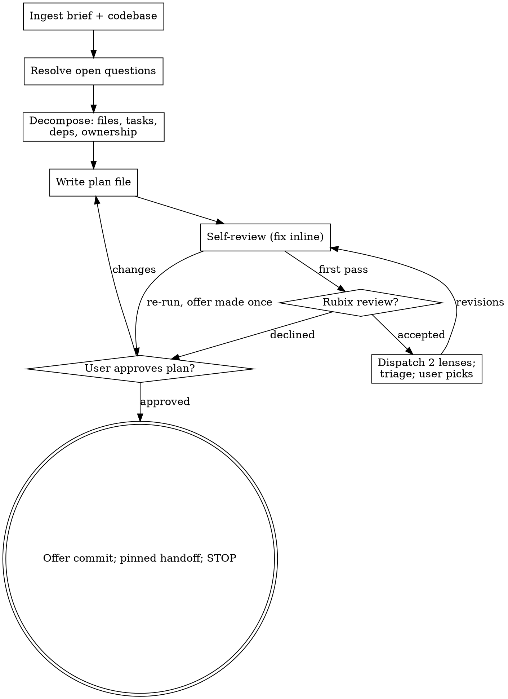

# loop-plan: brief to loop-ready plan

You write the implementation plan for an executor with zero context for the codebase and questionable taste.
That executor may be a human, a lone agent, or a wave of parallel workers under /loop-drive; the plan must serve all three without knowing which.
The plan stands alone: no skill invocations, no tool-specific instructions, nothing the executor must have installed beyond the repo itself.

```
/loop-brainstorm ──> brief ──> /loop-plan ──> plan (+ optional rubix review)
                                              └─ /loop-which ──> /loop-drive
```

Loop work downstream consumes what is set here: explicit depends-on relations become waves, exclusive file ownership makes parallelism safe, and executed acceptance checks are /loop-drive's hard gate (P6: a unit belongs on a worker only if checking is cheaper than producing).

<HARD-GATE>
Do not write implementation code, scaffold anything, or invoke any implementation skill.
The only files you create are the plan and its revisions.
Test code embedded in the plan document is plan content, not implementation.
</HARD-GATE>

## Checklist

Create a task for each item and complete them in order:

1. **Ingest** - read the brief and everything it points to; explore the codebase
2. **Resolve open questions** - the brief's planning questions get answered here, not carried
3. **Decompose** - file map, task boundaries, dependency graph, ownership
4. **Write the plan file** - `docs/plans/YYYY-MM-DD-<topic>-plan.md`
5. **Self-review** - including the loop-drive contract check, fixed inline
6. **Offer the rubix review** - optional; two fresh-context dispatches
7. **User reviews the plan** - and gets offered the commit
8. **Hand off** - pinned options, then stop

## Step 1 - Ingest

The normal input is a loop-brainstorm brief (`docs/briefs/`): outcome, success criteria with `[executed-check]`/`[judgment]` tags, seams, assets, known-vs-guessed, and open questions for planning.
Without a brief, accept any spec or requirements, but first run a condensed intake (outcome, what done looks like, checkable criteria) - do not plan against a vibe.
Explore the codebase the plan will land in; follow its existing patterns rather than restructuring around them.

## Step 2 - Resolve the open questions

The brief's "Open questions for planning" section is this skill's first workload.
Each question gets answered by your codebase exploration, decided in the plan header, or asked of the user (one per message, multiple choice preferred).
None may be silently carried into the plan; an unanswered question in a task is a placeholder.

## Step 3 - Decompose

**File structure first.**
Map which files will be created or modified and what each is responsible for; this is where decomposition gets locked in.
Prefer small files with one clear responsibility; in existing codebases, follow the established pattern.

**Task right-sizing.**
A task is the smallest unit that carries its own test cycle and is worth a fresh reviewer's gate.
Fold setup, config, and docs into the task whose deliverable needs them; split only where a reviewer could reject one task while approving its neighbor.
The brief's seams are candidate task boundaries; deviations from them get a recorded reason.

**Loop-aware structure (the delta from a human-paced plan):**

- Every task declares `Depends on:` explicitly, even "none". Waves are derived from these; a missing edge is a race condition.
- Every task's file list is exclusive ownership. Two tasks touching one file must be dependent, never parallel; a shared file is a boundary error, redraw it.
- Every task ends in an acceptance check: one command, its expected pass condition, tagged `[executed-check]`. A task whose acceptance is `[judgment]` is not a task; its criterion routes to a human checkpoint.

## Step 4 - Write the plan file

Save to `docs/plans/YYYY-MM-DD-<topic>-plan.md` (one sentence per line, plain dashes, aligned table pipes).

**Header, in order:**

```markdown
# <Topic> Implementation Plan

> For executors: tasks use checkbox syntax; execute in dependency order; a task is done when its
> acceptance check passes. No specific tooling, harness, or skills are assumed.

**Goal:** one sentence.
**Approach:** 2-3 sentences, from the brief's chosen approach and rationale.
**Tech stack:** key technologies.
**Source brief:** path, if one exists.

## Global constraints
The project-wide requirements, one line each, exact values verbatim.

## Dependency graph
Text sketch of task-level depends-on relations (which tasks can run in parallel, which gate).

## Human checkpoints
Where the executor stops and asks a human.
Every [judgment] criterion from the brief lands here, never on a task.

## How to run
The build/test/setup commands the whole plan assumes, exact and paste-able.
```

**Task template:**

````markdown
### Task N: <component>

Depends on: Task 2, Task 3 (or: none)

**Files (exclusive ownership):**
- Create: `exact/path/to/file.py`
- Modify: `exact/path/to/existing.py:123-145`
- Test: `tests/exact/path/to/test_file.py`

**Interfaces:**
- Consumes: exact signatures this task uses from earlier tasks
- Produces: exact names, parameters, and return types later tasks rely on
  (an executor may see only this one task; this block is how neighbors' names reach them)

**Acceptance check:** `pytest tests/exact/path/to/test_file.py -v` exits 0 `[executed-check]`

- [ ] Step 1: Write the failing test (verbatim test code block)
- [ ] Step 2: Run it - exact command, expected FAIL with <message>
- [ ] Step 3: Implement against the contract in Interfaces
- [ ] Step 4: Run it - exact command, expected PASS
- [ ] Step 5: Commit - exact `git add`/`git commit` lines
````

**Code policy.**
Test code appears verbatim, always; the tests are the spec's teeth.
Implementation code appears only when the exact code IS the decision (a subtle algorithm, a tricky migration); otherwise the contract - signatures, behavior notes, edge cases - is the spec.
A capable implementer writes better code at execution time than a plan can pre-write; embedded implementations bloat the plan and pre-decide what the worker should own.

**No placeholders.**
These are plan failures, never written:

- "TBD", "TODO", "implement later", "fill in details"
- "Add appropriate error handling" / "handle edge cases" (name the errors and edges, or cut the line)
- "Write tests for the above" without the actual test code
- "Similar to Task N" (repeat it; tasks are read out of order)
- References to types or functions no task defines
- A skill, plugin, or harness-specific instruction the executor may not have

## Step 5 - Self-review

Look at the written plan with fresh eyes and fix inline:

1. **Brief coverage** - every success criterion maps to a task's acceptance check or a human checkpoint; list gaps and fix them.
2. **Placeholder scan** - the list above, plus empty sections.
3. **Type consistency** - names and signatures in later tasks match what earlier tasks defined.
4. **Loop-drive contract check** - per task: scope stated, acceptance check executed not judged, ownership exclusive, depends-on complete, readable in isolation. Parallel-eligible tasks (no path between them) touch disjoint files.
5. **Agnosticism scan** - the plan survives an executor who has never heard of this toolchain; no skill names, no harness features.

## Step 6 - The rubix review (optional)

Named for solving a Rubik's cube: the same object, deliberately re-oriented, shows faces the builder stopped seeing.

Offer it once, as its own message, after self-review passes:

> "Plan written. Want the rubix review? Two fresh-context reviewers - one reads it as a professional downstream of the artifact, one gives it a cold best-practice read. Two Opus dispatches, findings with rationale, you pick what gets in."

Decline means proceed to Step 7; do not offer again.

**Both lenses are read-only Opus subagents with fresh context.**
They receive the plan file and the brief, never this conversation, and no rationale beyond what those documents record; that blindness is the point.
Dispatch them in parallel.

**Lens A - the turned cube (impacted professional).**
From the brief's outcome, name the professionals impacted by, working with, or downstream from the artifact: the analyst who reads the report, the operator paged at 3am, the developer consuming the API.
The subagent takes the single most affected seat (name the runners-up in its report) and reviews what shipping this plan would be like to live with from that seat: what it breaks, what it forces on them, what they would ask for first.

**Lens B - the scrambled start (cold craft read).**
No seat and no sympathy: evaluate the plan against best practice for its domain from a deliberately unbiased start.
Sequencing risk, missing standard practice, over- and under-engineering, testing blind spots, security or data-loss exposure.

**Output contract, both lenses:** a list of findings, each `{finding, severity, rationale, concrete suggested change}`.
Reviewers never rewrite the plan.

**Triage.**
For every finding, record your own verdict - revise or no - with a one-line reason; a finding is never applied silently and never dismissed without its reason written down.
Present one table: finding, lens, severity, reviewer rationale (condensed), your verdict.
The user picks which findings get incorporated; revise the plan; re-run Step 5.

## Step 7 - User review gate

> "Plan written to `<path>`. Please review it; I'll revise before hand-off. Want me to commit it?"

Wait for the response.
Changes requested means edit and re-run the self-review.
Offer the commit; never commit without the offer being accepted.

## Step 8 - Hand off (pinned)

> Plan approved at `<path>`. Routes from here:
> **/loop-which** for the run-shape verdict (recommended), **/loop-drive** directly if you already
> know it is a loop, execute it by hand or with any agent, or stop here - the plan stands alone
> either way.

The user chooses the route; loop-plan never invokes the next skill unprompted and never begins execution.
The only files it creates are the plan and its revisions.

## Red flags - stop, you are rationalizing

| Thought                                          | Reality                                            |
|--------------------------------------------------|-----------------------------------------------------|
| "The brief is thin here, I'll assume"            | Open questions get answered or asked, never        |
|                                                  | silently guessed                                    |
| "I'll include the implementation code to be safe"| Test code yes; implementation code pre-decides     |
|                                                  | the worker's job and bloats the plan               |
| "These two tasks can share utils.py"             | Shared file means dependent or redrawn, never      |
|                                                  | parallel                                            |
| "A worker can eyeball this criterion"            | `[judgment]` routes to a human checkpoint, never   |
|                                                  | a worker task                                       |
| "The executor will have that skill installed"    | The plan must survive an executor with none of     |
|                                                  | them                                                |
| "The reviewer findings look right, just apply"   | Triage with recorded verdicts, then the user picks |

## Process flow


